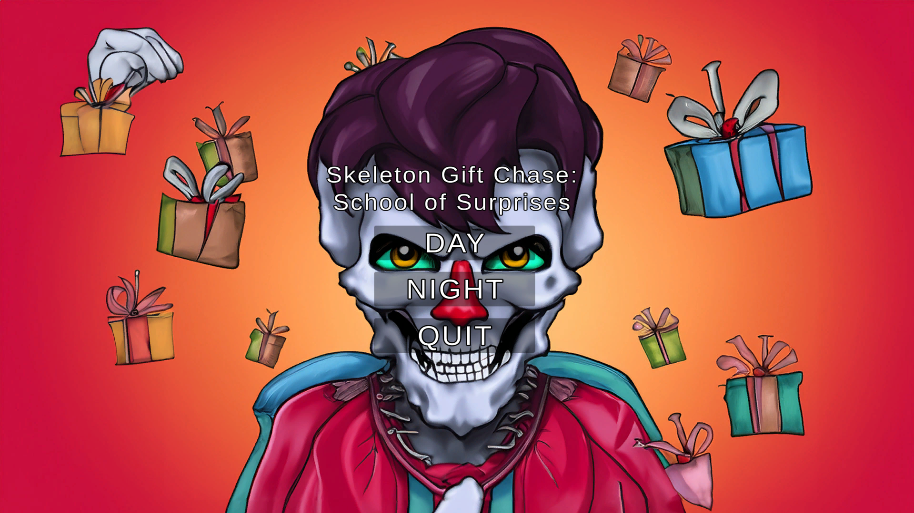
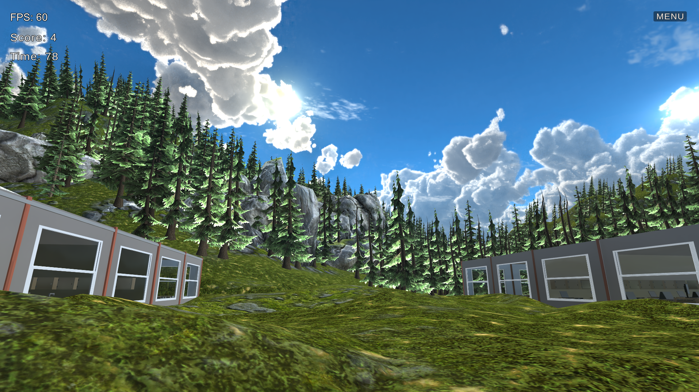
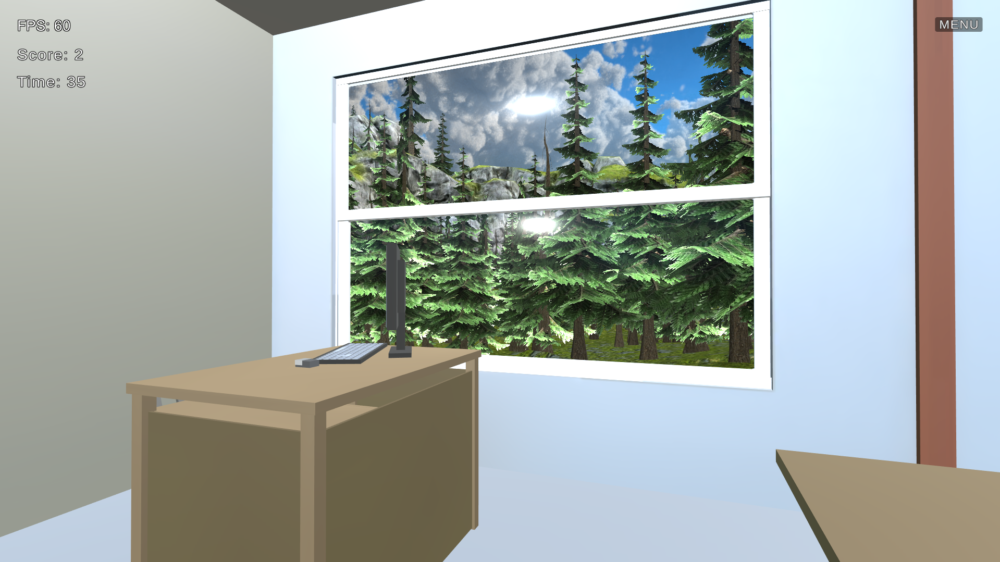
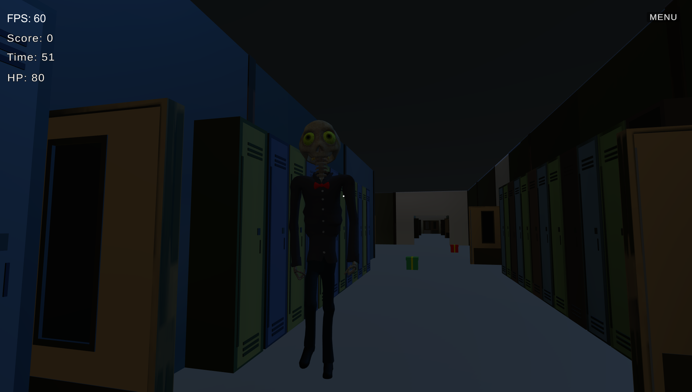
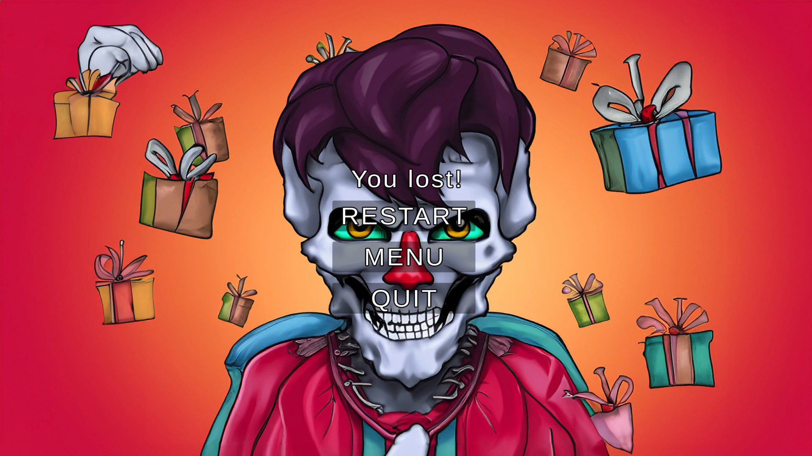
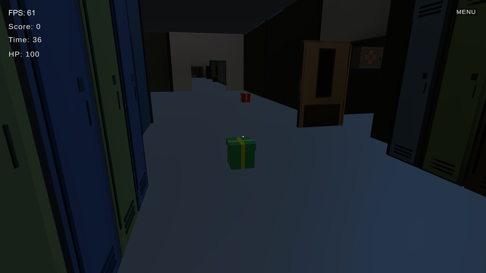

# Zombie Gift Chase: School of Surprises

## Final project for the course Inteligent interfaces
## Developed by:
- **Oleh Petrov**
- **Valeriia Rudenko**

## Introduction

Welcome to **Zombie Gift Chase: School of Surprises**, our final project for the Intelligent Interfaces course. This Unity-based game promises a unique and thrilling experience set in a school environment, where surprises await at every turn.
This is the menu of our game:

## Technical details
- **Unity version:** [2022.3.15f1]
- **Used assets:**
    - Rocky Hills environment -Light pack
    - School assets
    - Skybox series Free
    - Modular First Person Controller
    - Skeleton Ghost 

## Preliminary prototype of the school

## How the game is looks like
The school is in the forest, you cannot go there, but you can see this forest from the school window like on the pictures below. 

 ## Day and night modes
 - **Day Mode:**
    - Collect presents scattered throughout the school. 
    - Presents dynamically generate, creating a continuous challenge for players. 
    - A counter keeps track of the collected presents.

- **Night Mode:** 
    - Brace yourself for a spine-chilling experience as a relentless skeleton hunts you down while you attempt to collect presents. 
    Here you can see how the skeleton looks like.
    
    - You start with 100 lives, and the game ends if you lose them all.
    If you died you will see such menu:
    

- **Skeleton Animation and Sound:**
  - The skeleton features animations for idle and walking.
  - When the skeleton approaches the player, an attack animation plays upon contact.
  - A distinct sound accompanies the skeleton's attack, intensifying the gaming experience.

  **Player Interactions:**
  - When the player collects gifts, a sound effect is triggered, providing audio feedback for successful interactions.
  On this picture you can see how the gifts looks like in night mode.
  
  
  **Audio Feedback:**
  - Experience the game's intensity through immersive sound effects.
  - Impactful sounds accompany the skeleton's attacks.

## Time management
- **Timer:** Keep track of your progress with a timer that records the time spent in both day and night modes.

## Interactive Boards
- **Real-Time Camera Feed:**
    - Activate your in-game camera with the press of a button (O), allowing real-time self-view on interactive boards. Deactivate the camera with another button (P).
- **Voice Recording:**
    - Record your voice by pressing 'R' near the interactive boards, enabling message sharing and unique in-game experiences.
- **Voice Recognition:**
    - Hold down the 'L' key to activate voice recognition, adding an extra layer of interactivity.
     
## Sensors:

- **FPS Sensor:**
  - Monitor Frames Per Second (FPS) to ensure smooth gameplay.

- **Score Sensor:**
  - Keep track of the player's score as they collect presents in both day and night modes.

- **Time Sensor:**
  - Record the elapsed time in both day and night modes, providing players with a time-based challenge.

- **HP Sensor:**
  - Track the player's health points (HP) during night mode when facing the skeleton.

## Voice-Activated Skeleton Behavior:

- **Voice Command: "STOP":**
  - In response to the voice command "STOP," the skeleton stops pursuing the player.
  - The skeleton remains stationary, visibly frustrated, and taps its foot in place.

- **Voice Command: "MOVE":**
  - In response to the voice command "MOVE," the skeleton resumes its pursuit, following the player's movements.

## Enhanced Player Controls:
- Quick Run: Speed up movement by pressing the Shift key.

## Group agreements
### Tasks Developed in Group

- **Scenario Design:**
  - Both team members collaborated on designing the overall scenario and game concept.
  - Brainstormed ideas for the day and night modes to create an engaging user experience.

- **Bug Testing and Optimization:**
  - Shared responsibilities for bug testing and optimizing the game for performance.
  - Collaboratively addressed issues raised during testing phases.

### Tasks Developed Individually

- **Oleh Petrov:**
  - Implemented the day mode gameplay mechanics, including present generation and collection.
   - Integrated the real-time camera feed on interactive boards.
   - Managed the sound effects and audio feedback.
  
- **Valeriia Rudenko:**
   - Created the initial prototype of the school environment.
   - Handled the integration of Unity assets, ensuring visual consistency in the game environment.
   - Implemented the timer functionality to track the player's progress in both day and night modes.
   - Assisted with the preparation of project documentation.

